# P³ Interview Academy - Architecture Diagram

## System Architecture Overview

```mermaid
graph TB
    %% User Interface Layer
    subgraph "Frontend - React Application"
        UI[User Interface]
        
        subgraph "Core Pages"
            Landing[Landing Page]
            Prepare[Prepare Module]
            Practice[Practice Module] 
            Perform[Perform Module]
            Review[Review Dashboard]
        end
        
        subgraph "Components"
            Coach[Interview Coaching]
            Voice[Voice Recorder]
            Lang[Language Selector]
            Feedback[Feedback Panel]
            Progress[Progress Tracker]
        end
        
        subgraph "State Management"
            Context[Session Context]
            Query[TanStack Query]
            Forms[React Hook Form]
        end
    end

    %% Application Layer
    subgraph "Backend - Node.js/Express"
        API[Express API Server]
        
        subgraph "Route Handlers"
            CoachRoute[Coaching Routes]
            PrepRoute[Prepare Routes]
            AuthRoute[Auth Routes]
        end
        
        subgraph "Core Services"
            CoachEngine[Coaching Engine Service]
            AIRouter[AI Router Service]
            TranslationSvc[Translation Service]
            IndustrySvc[Industry Intelligence]
            QuestionBank[Question Bank Service]
            LanguageSvc[Language Service]
        end
        
        subgraph "AI Integration"
            OpenAISvc[OpenAI Service]
            SealionSvc[SeaLion Service]
            AnthropicSvc[Anthropic Service]
            BedrockSvc[Bedrock Service]
        end
    end

    %% Data Layer
    subgraph "Database - PostgreSQL"
        DB[(Neon PostgreSQL)]
        
        subgraph "Core Tables"
            Users[users]
            Sessions[coaching_sessions]
            Messages[coaching_messages]
            Scenarios[interview_scenarios]
            Questions[industry_questions]
        end
        
        subgraph "Session Management"
            ExpressSessions[express_sessions]
            AuthSessions[replit_auth_sessions]
        end
    end

    %% External Services
    subgraph "External AI Services"
        OpenAI[OpenAI GPT-4o]
        SeaLion[SeaLion LLM<br/>Southeast Asian AI]
        Claude[Anthropic Claude]
        Bedrock[AWS Bedrock]
    end

    %% Integrations
    subgraph "External Integrations"
        ReplitAuth[Replit Authentication]
        PrepModule[P³ Prepare Module<br/>External Deployment]
    end

    %% Language Support
    subgraph "Multi-Language Support"
        EN[English - Primary]
        MS[Bahasa Malaysia]
        ID[Bahasa Indonesia]
        TH[Thai]
        VI[Vietnamese]
        FIL[Filipino]
        MY[Myanmar]
        KM[Khmer]
        LO[Lao]
        ZHSG[Chinese Singapore]
    end

    %% Connections
    UI --> API
    Landing --> Coach
    Practice --> Coach
    Perform --> Coach
    
    Coach --> Voice
    Coach --> Lang
    Coach --> Feedback
    Coach --> Progress
    
    API --> CoachRoute
    API --> PrepRoute
    API --> AuthRoute
    
    CoachRoute --> CoachEngine
    CoachEngine --> AIRouter
    CoachEngine --> TranslationSvc
    CoachEngine --> IndustrySvc
    CoachEngine --> QuestionBank
    
    AIRouter --> OpenAISvc
    AIRouter --> SealionSvc
    AIRouter --> AnthropicSvc
    AIRouter --> BedrockSvc
    
    OpenAISvc --> OpenAI
    SealionSvc --> SeaLion
    AnthropicSvc --> Claude
    BedrockSvc --> Bedrock
    
    API --> DB
    Users --> Sessions
    Sessions --> Messages
    Sessions --> Scenarios
    Scenarios --> Questions
    
    Context --> Query
    Query --> API
    Forms --> API
    
    ReplitAuth --> API
    Prepare --> PrepModule
    
    TranslationSvc --> EN
    TranslationSvc --> MS
    TranslationSvc --> ID
    TranslationSvc --> TH
    TranslationSvc --> VI
    TranslationSvc --> FIL
    TranslationSvc --> MY
    TranslationSvc --> KM
    TranslationSvc --> LO
    TranslationSvc --> ZHSG

    %% Styling
    classDef frontend fill:#e1f5fe,stroke:#01579b,stroke-width:2px
    classDef backend fill:#f3e5f5,stroke:#4a148c,stroke-width:2px
    classDef database fill:#e8f5e8,stroke:#1b5e20,stroke-width:2px
    classDef external fill:#fff3e0,stroke:#e65100,stroke-width:2px
    classDef ai fill:#fce4ec,stroke:#880e4f,stroke-width:2px
    classDef language fill:#f1f8e9,stroke:#33691e,stroke-width:2px

    class UI,Landing,Prepare,Practice,Perform,Review,Coach,Voice,Lang,Feedback,Progress,Context,Query,Forms frontend
    class API,CoachRoute,PrepRoute,AuthRoute,CoachEngine,AIRouter,TranslationSvc,IndustrySvc,QuestionBank,LanguageSvc backend
    class DB,Users,Sessions,Messages,Scenarios,Questions,ExpressSessions,AuthSessions database
    class ReplitAuth,PrepModule external
    class OpenAI,SeaLion,Claude,Bedrock,OpenAISvc,SealionSvc,AnthropicSvc,BedrockSvc ai
    class EN,MS,ID,TH,VI,FIL,MY,KM,LO,ZHSG language
```

## Key Architectural Components

### Frontend Architecture (React + TypeScript)
- **Framework**: React 18 with TypeScript and Vite
- **Routing**: Wouter for lightweight client-side routing
- **State Management**: React Context + TanStack Query
- **UI Components**: Shadcn/ui (Radix UI primitives) + Tailwind CSS
- **Form Handling**: React Hook Form with Zod validation

### Backend Architecture (Node.js + Express)
- **Runtime**: Node.js with Express.js and TypeScript
- **API Design**: RESTful endpoints with structured error handling
- **Session Management**: Express sessions with PostgreSQL storage
- **Authentication**: Replit Auth integration

### AI Integration Strategy
- **Primary AI**: OpenAI GPT-4o for interview generation and evaluation
- **Regional AI**: SeaLion LLM for Southeast Asian language support
- **Fallback Options**: Anthropic Claude and AWS Bedrock
- **Smart Routing**: AI Router dynamically selects optimal service

### Database Design (PostgreSQL + Drizzle ORM)
- **Database**: Neon serverless PostgreSQL
- **ORM**: Drizzle ORM for type-safe database operations
- **Schema**: Comprehensive tables for users, sessions, messages, scenarios, and questions
- **Performance**: Indexed queries and connection pooling

### Multi-Language Support
- **Bilingual UX**: English primary content with ASEAN language translations
- **Translation Engine**: SeaLion-powered translation service
- **Supported Languages**: 10 Southeast Asian languages
- **Voice Recognition**: Native language speech-to-text integration

### Key Features
1. **Dynamic Question Generation**: AI creates personalized interview questions based on job position and company
2. **STAR Method Evaluation**: Structured assessment using Situation, Task, Action, Result framework
3. **Real-time Coaching**: Instant AI feedback and improvement suggestions
4. **Progress Tracking**: Comprehensive analytics and skill development monitoring
5. **Voice Interaction**: Full voice recording and speech recognition capabilities

### External Integrations
- **P³ Prepare Module**: Embedded iframe integration for preparation content
- **Replit Authentication**: Seamless user authentication and session management
- **AI Services**: Multiple AI providers for reliability and performance

### Development Stack
- **Build Tool**: Vite for fast development and building
- **Type Safety**: TypeScript across entire stack
- **Testing**: Vitest with React Testing Library
- **Styling**: Tailwind CSS with custom design system
- **Package Management**: npm with lock file for consistency

## Data Flow

1. **User Authentication**: Replit Auth → Express Sessions → PostgreSQL
2. **Interview Session**: Frontend → API Routes → Coaching Engine → AI Services
3. **Translation Pipeline**: English Content → Translation Service → SeaLion → Localized Output
4. **Voice Processing**: Web Audio API → Speech Recognition → Text Processing
5. **Progress Tracking**: Session Data → Analytics Engine → Dashboard Visualization

## Deployment Architecture

- **Frontend**: Vite build served through Express
- **Backend**: Node.js Express server
- **Database**: Neon PostgreSQL with connection pooling
- **AI Services**: External API integrations with fallback mechanisms
- **Static Assets**: Served through Express with Vite integration
